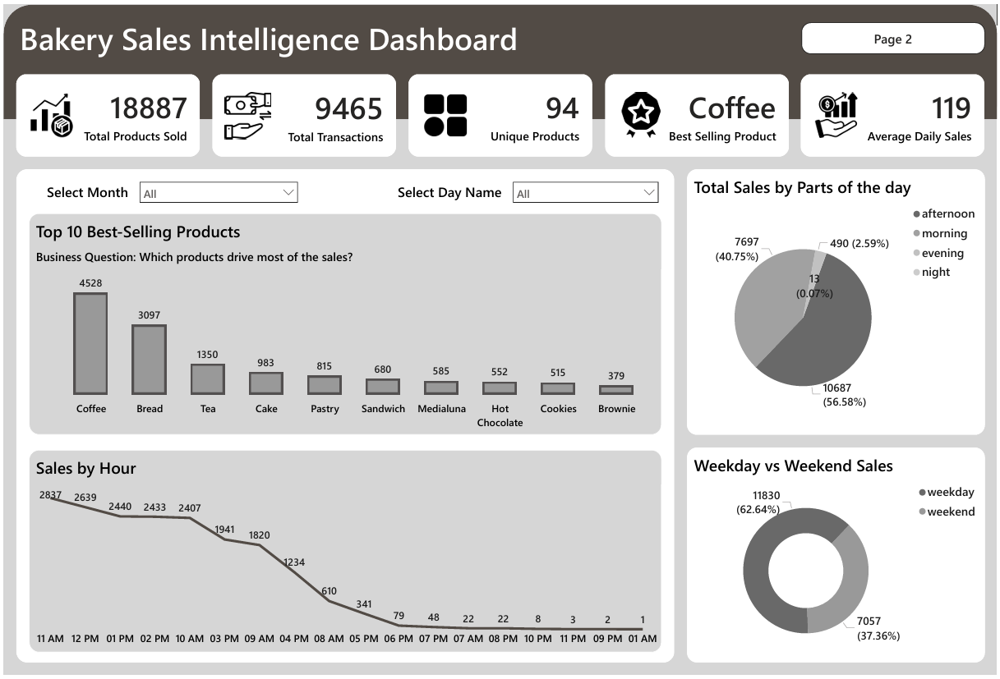
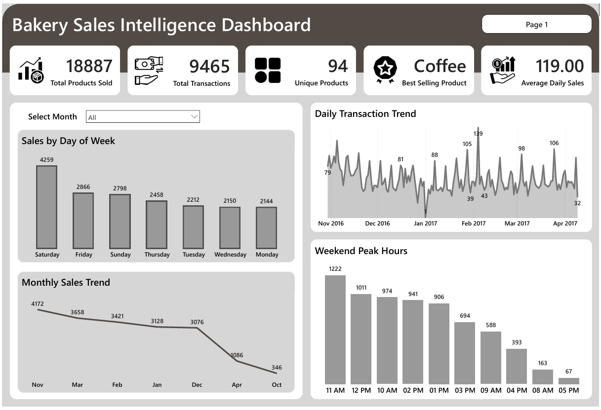
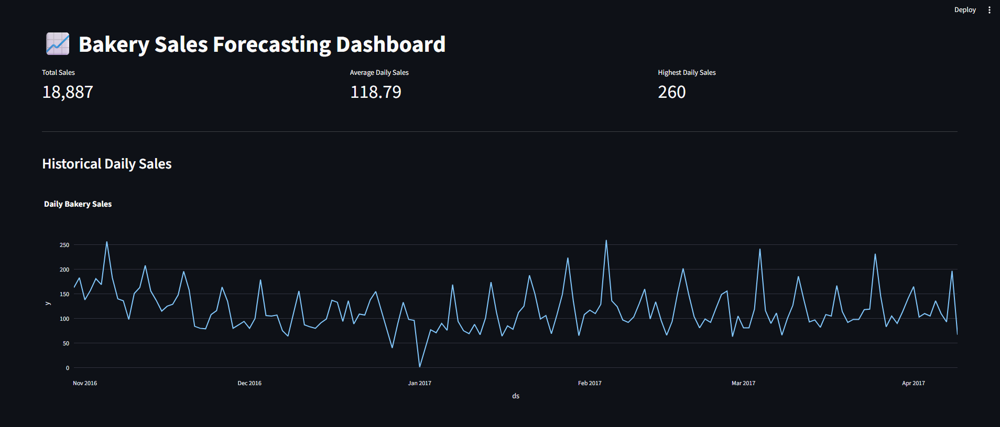
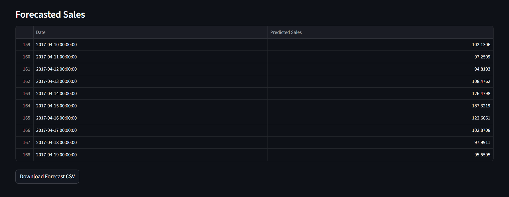

# 🥐 Bakery Sales Intelligence Dashboard with Sales Forecasting

## 📌 Project Overview

The Bakery Sales Intelligence Dashboard is an end-to-end Data Analytics project designed to analyze bakery transaction data and generate actionable business insights.

The project focuses on:

- Sales performance analysis
- Product demand analysis
- Customer purchasing behavior
- Peak sales hour identification
- Weekday vs Weekend sales comparison
- Monthly and daily sales trend analysis
- Future sales forecasting

The solution combines Python for data cleaning, MySQL for analytical queries, Power BI for dashboard development, and Streamlit for sales forecasting visualization.

---

## 🎯 Business Problem

Bakery businesses generate thousands of transactions daily. Without proper analysis, it becomes difficult to identify:

- Best-selling products
- Peak business hours
- Customer purchasing patterns
- Sales trends over time
- Future sales demand

This project helps bakery owners make data-driven decisions regarding inventory management, staffing, and sales strategy.

---

## 🛠️ Technologies Used

| Category | Technology |
|-----------|------------|
| Programming Language | Python |
| Data Cleaning | Pandas |
| Database | MySQL Workbench |
| Query Language | SQL |
| Data Visualization | Power BI |
| Forecasting Dashboard | Streamlit |
| Forecasting Library | Prophet |

---

## 📂 Dataset Information

The dataset contains bakery transaction records including:

- Transaction ID
- Product Name
- Date & Time
- Period of Day
- Weekday / Weekend Indicator

### Dataset Columns

| Column Name | Description |
|------------|-------------|
| Transaction | Unique transaction identifier |
| Item | Product purchased |
| date_time | Date and time of transaction |
| period_day | Morning, Afternoon, Evening, Night |
| weekday_weekend | Weekday or Weekend |
| Date | Extracted transaction date |
| Month | Extracted month |
| Hour | Extracted hour |
| Day_Name | Extracted weekday name |

📄 **Raw Data:** [`Raw Data`](./data/raw/bakery_sales.csv)

---

# 🧹 Data Cleaning Process

Data preprocessing was performed using Python and Pandas.

### Cleaning Steps

- Removed duplicate records
- Converted date_time to datetime format
- Created Date column
- Created Month column
- Created Hour column
- Created Day_Name column
- Standardized text formatting
- Validated data quality

📄 **Jupyter Notebook File:** [`Data Cleaning File`](./scripts/data_cleaning.ipynb)
📄 **Cleaned Data:** [`Data After Cleaning`](./data/cleaned/cleaned_bakery_sales.csv)

---

# 🗄️ SQL Analysis

The cleaned dataset was imported into MySQL Workbench for analysis.

### Key Analytical Questions

1. What are the top-selling bakery products?
2. Which products have the lowest sales?
3. What is the peak sales hour?
4. Are weekday sales higher than weekend sales?
5. Which time period generates the most sales?
6. What are the monthly sales trends?
7. What are the daily transaction trends?
8. Which products are most popular in the morning?
9. Which products are most popular in the evening?
10. What are the busiest weekend hours?

📄 **SQL Script Used:** [`SQL Analysis`](./sql/sql_analysis.sql)

---

# 📊 Power BI Dashboard

The Power BI dashboard was developed to provide interactive business intelligence insights.

📄 **Power Bi Dashboard File:** [`Bakery Sales Intelligence Dashboard`](./dashboard)

---

## KPI Cards

- Total Products Sold
- Total Transactions
- Unique Products
- Best Selling Product
- Average Daily Sales

---

# 📸 Dashboard Screenshots

### Page 1: 



---

### Page 2: 



---

# 📈 Sales Forecasting

A separate Streamlit application was developed to visualize future bakery sales trends.

### Forecasting Features

- Historical Daily Sales Analysis
- Average Daily Sales KPI
- Highest Daily Sales KPI
- Future Sales Forecasting
- Interactive Forecast Dashboard
- Forecast Export Option

---

### Sales Forecast Dashboard  



---

## Run Forecast Dashboard

Install dependencies:

```bash
pip install streamlit prophet plotly pandas
```

Run application:

```bash
streamlit run forecast_app.py
```

#### Next 10 Days Forecast 



---

# 💡 Business Insights

### Product Performance

- Coffee is the highest-selling product.
- Bread is the second most purchased product.
- Tea, Cake, and Pastry are among the top-performing products.

### Customer Behavior

- Weekday sales account for approximately 63% of total sales.
- Weekend sales contribute approximately 37%.
- Afternoon sales represent the largest share of transactions.

### Sales Timing

- Peak sales occur between 11 AM and 2 PM.
- Customer activity decreases significantly after 5 PM.

### Trends

- Daily sales fluctuate throughout the year.
- Several high-demand periods indicate seasonal purchasing patterns.

### Forecasting

- Forecasting helps estimate future product demand.
- Insights can support inventory planning and staffing decisions.

---

# 📁 Project Structure

```text
Bakery-Sales-Intelligence-Dashboard/
│
├── data/
│   ├── bakery_sales.csv
│   └── cleaned_bakery_sales.csv
│
├── scripts/
│   ├── data_cleaning.ipynb
│   └── forecast_app.py
│
├── sql/
│   └── sql_analysis.sql
│
├── dashboard/
│   └── Bakery Sales Intelligence Dashboard.pbit
│
├── forecast/
│   └── next_10_days_forecast.png
│
├── screenshots/
│   ├── Bakery_Sales_Intelligence_Dashboard_Page1.png
│   ├── Bakery_Sales_Intelligence_Dashboard_Page1.png
│   └── forecast_dashboard.png
│
└── README.md
```

---

# 🚀 How to Run the Project

### Clone Repository

```bash
git clone https://github.com/yourusername/Bakery-Sales-Intelligence-Dashboard.git
```

### Install Dependencies

```bash
pip install -r requirements.txt
```

### Run Streamlit Forecasting Dashboard

```bash
streamlit run forecast_app.py
```

---

# 📊 Key Metrics

| Metric | Value |
|----------|---------|
| Total Products Sold | 18,887 |
| Total Transactions | 9,465 |
| Unique Products | 94 |
| Best Selling Product | Coffee |
| Average Daily Sales | 118.79 |

---

# 🎓 Skills Demonstrated

- Data Cleaning
- Data Transformation
- SQL Querying
- MySQL Workbench
- Data Visualization
- Power BI Dashboard Development
- Business Intelligence
- KPI Reporting
- Sales Analytics
- Time-Series Forecasting
- Streamlit Development

---

# 👨‍💻 Author

**👤 Kirti Sundar Dey**  
📊 Data Analyst | Power BI | SQL | Python  
🎓 Internship Project by **Rubixe – AI Solutions Company**  
📍 Bengaluru, India  
🔗 [LinkedIn](https://www.linkedin.com/in/kirti-sundar-dey-0954122a5)  

---

## ⭐ If you found this project useful, please give it a star.
